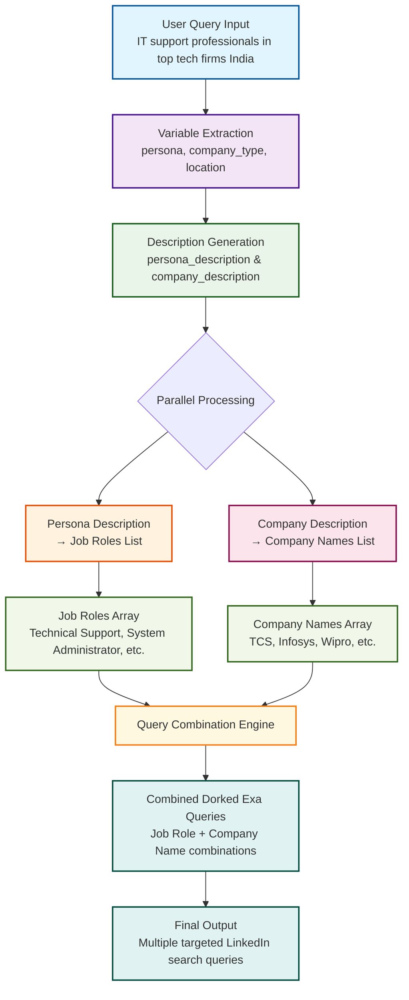

# LinkedIn Lead Research Flow

## Overview
This document describes the complete flow for generating targeted LinkedIn lead research queries based on user input. The process transforms a natural language query into structured search combinations that can be used for lead generation.

## Flow Diagram



## Flow Description

### 1. User Query Input
- **Purpose**: The starting point where users provide their research requirements in natural language
- **Example**: IT support professionals in top tech firms India
- **Why**: Captures the user's intent in their own words, making the system accessible and user-friendly

### 2. Variable Extraction
- **Purpose**: Parse the user query to extract three key variables: persona, company_type, and location
- **Process**: Uses the `varible-extractor.md` prompt to identify and extract structured data from unstructured text
- **Output**: JSON with persona, company_type, location, and has_all flag
- **Why**: Standardizes the input and ensures we have the necessary components for the next steps

### 3. Description Generation
- **Purpose**: Transform the extracted variables into comprehensive descriptions that capture the broader scope
- **Process**: Uses the `extracted-variables-to-description.md` prompt to create:
  - `persona_description`: Broader description of the job role and responsibilities
  - `company_description`: Comprehensive description of the company type and industry
- **Why**: Creates more nuanced and inclusive descriptions that can capture a wider range of potential leads

### 4. Parallel Processing Paths

#### Left Path: Persona Description → Job Roles
- **Purpose**: Convert the persona description into a list of specific job titles
- **Process**: Uses the `job-description-to-role-list.md` prompt to generate standardized job roles
- **Output**: Array of job titles (e.g., Technical Support, System Administrator)
- **Why**: Job titles are more searchable on LinkedIn than descriptions

#### Right Path: Company Description → Company Names
- **Purpose**: Convert the company description into a list of actual company names
- **Process**: Uses the `company-description-and-location-to-list.md` prompt to generate real company names
- **Output**: Array of company names (e.g., TCS, Infosys, Wipro)
- **Why**: Company names are more precise for targeted searches

### 5. Query Combination
- **Purpose**: Create comprehensive search queries by combining job roles with company names
- **Process**: Generates all possible combinations of job roles × company names
- **Output**: Multiple targeted search queries for LinkedIn lead research
- **Why**: Each combination represents a specific target audience that can be approached with tailored messaging

## Why Separate Prompts?

### 1. **Specialization**: Each prompt is optimized for a specific task
   - Variable extraction requires precision in parsing
   - Description generation needs contextual understanding
   - Job role generation requires industry knowledge
   - Company listing requires business intelligence

### 2. **Modularity**: Each step can be improved independently
   - Better extraction algorithms don't affect description quality
   - Enhanced company databases don't require prompt changes
   - Job role updates can be made without touching other components

### 3. **Quality Control**: Each step can be validated separately
   - Extraction accuracy can be measured independently
   - Description relevance can be assessed
   - Job role completeness can be verified
   - Company list accuracy can be checked

### 4. **Flexibility**: Different combinations can be used
   - Some queries might only need job roles
   - Others might focus on company targeting
   - The modular approach allows for different strategies

## Example Flow

**Input**: IT support professionals in top tech firms India

**Step 1 - Extraction**:
```json
{
  persona: IT support professionals,
  company_type: top tech firms, 
  location: India,
  has_all: true
}
```

**Step 2 - Descriptions**:
```json
{
  persona_description: IT-support professionals who assist users by diagnosing and resolving technical issues, managing hardware and software, and ensuring smooth operation of computer systems,
  company_description: Indian technology‑services and consulting providers that range from home‑grown IT giants to the arms of global firms delivering large‑scale software development, digital transformation, and outsourced IT solutions
}
```

**Step 3 - Lists**:
- Job Roles: [Technical Support, Desktop Support, System Administrator, IT Technician, ...]
- Company Names: [TCS, Infosys, Wipro, HCL, Tech Mahindra, ...]

**Step 4 - Combinations**: 
- Technical Support + TCS
- Technical Support + Infosys
- Desktop Support + TCS
- ... (all combinations)

**Final Output**: Multiple targeted LinkedIn search queries for lead generation 